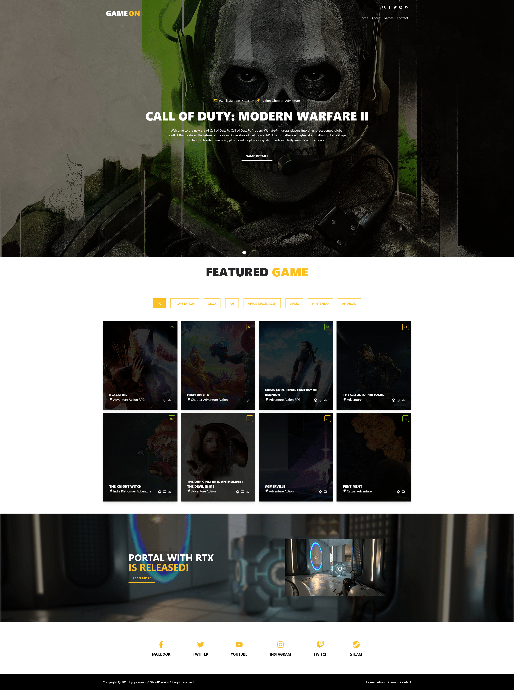

# Game Site Project

Lorem ipsum dolar amet sit Lorem ipsum dolar amet sitLorem ipsum dolar amet sitLorem ipsum dolar amet sitLorem ipsum dolar amet sitLorem ipsum dolar amet sitLorem ipsum dolar amet sitLorem ipsum dolar amet sitLorem ipsum dolar amet sitLorem ipsum dolar amet sitLorem ipsum dolar amet sitLorem ipsum dolar amet sitLorem ipsum dolar amet sitLorem ipsum dolar amet sit

> Create a `.env` file and enter your `rawg.io` api key
>
> ```js
> VITE_RAWG_IO_API_KEY=
> ```



## Used Technogies

- [React](https://reactjs.org/)
- [React Router](https://reactrouter.com/)
- [Tailwind](https://tailwindcss.com/)
- [Vite](https://vitejs.dev/)
- [Rawg.io API](https://rawg.io/apidocs)

## Contributors

<a href='https://github.com/eyupcanee'>
    
</a>
